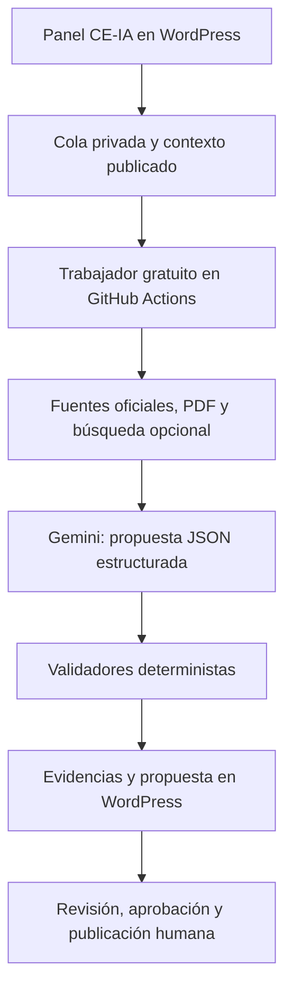

# CE-IA · Auditor de Trámites

Sistema gratuito, controlado desde WordPress, para investigar y mantener las páginas de trámites del Consejo de Estudiantes de la Universidad de Oviedo.

CE-IA no es un cambiador de fechas. Recupera fuentes públicas, sigue enlaces oficiales, extrae HTML y PDF, contrasta hechos, detecta contradicciones y prepara una versión completa y didáctica de la página. La decisión final sigue siendo humana.

## Resultado

- Complemento independiente para WordPress: no sustituye ni modifica el plugin `Trámites UniOvi` 1.1.1.
- Sincronización no destructiva con los 171 registros actuales de `wp_tramites`.
- Panel de elementos, fuentes, cola, evidencias, propuestas, configuración y auditoría.
- Trabajador Python gratuito ejecutable en GitHub Actions.
- Gemini 3.1 Flash-Lite gratuito como analista; Tavily gratuito es opcional y solo descubre candidatos.
- Fuentes críticas ordenadas por autoridad: boletín oficial, sede, portal institucional, web del Consejo y pistas externas.
- Salida JSON tipada antes de aceptar cualquier HTML.
- Aprobación, publicación y reversión separadas.
- Publicación bloqueada ante conflicto, evidencia insuficiente, HTML inseguro o propuesta caducada.
- Sin autopublicación y sin proveedor de pago alternativo.

## Arquitectura



WordPress conserva el control. El usuario técnico del trabajador solo tiene `ceia_submit_research`; no puede editar páginas, aprobar ni publicar.

## Estructura

```text
wordpress/ce-ia-auditor/  Complemento instalable en WordPress
worker/                    Trabajador Python y pruebas
.github/workflows/         Pruebas y ejecución programada
docs/                      Instalación, seguridad y operación
```

## Puesta en marcha

1. Lee [Instalación completa](docs/SETUP.md).
2. Instala el ZIP del complemento en WordPress y actívalo.
3. En `CE-IA → Configuración`, guarda una clave gratuita de Gemini y deja Tavily desactivado al principio.
4. Crea un usuario WordPress con el rol `Trabajador CE-IA` y genera una contraseña de aplicación.
5. Añade en GitHub los tres secretos indicados en la guía.
6. Ejecuta las pruebas y un piloto de tres trámites.
7. Revisa las evidencias en WordPress; aprueba y publica solo tras comprobarlas.
8. Mantén la cola automática desactivada hasta completar el piloto y configurar el límite de gasto de GitHub.

## Coste cero

- Los minutos estándar de GitHub Actions son gratuitos en repositorios públicos; GitHub Free incluye una cuota mensual para repositorios privados. Durante el piloto, los workflows son exclusivamente manuales y la auditoría procesa un único expediente por ejecución.
- El modelo predeterminado es `gemini-3.1-flash-lite`, disponible en el nivel gratuito. No hay fallback de pago.
- Tavily está desactivado por defecto. Si se activa, usa búsquedas `basic`, limita dos consultas por expediente y se detiene al agotar la cuota.
- Para una garantía operativa adicional, configura el presupuesto de GitHub en 0 € y no habilites facturación en los proveedores de IA.

Fuentes técnicas: [Gemini Structured Outputs](https://ai.google.dev/gemini-api/docs/structured-output), [precios de Gemini](https://ai.google.dev/gemini-api/docs/pricing), [Tavily Search](https://docs.tavily.com/documentation/api-reference/endpoint/search), [facturación de GitHub Actions](https://docs.github.com/en/billing/concepts/product-billing/github-actions) y [REST API de WordPress](https://developer.wordpress.org/rest-api/extending-the-rest-api/adding-custom-endpoints/).

## Estado

Versión de piloto de coste cero `0.10.1`. Antes de activar la programación para los 171 trámites debe completarse el piloto controlado descrito en [Operación](docs/OPERATIONS.md).


## Estado del despliegue inicial

Durante el piloto, los dos workflows solo pueden iniciarse manualmente desde la pestaña **Actions**. No existe programación automática ni ejecución al hacer `push`. La auditoría piloto procesa como máximo un trámite y nunca publica automáticamente: devuelve una propuesta a WordPress para revisión humana.

El repositorio no contiene claves. Gemini se guarda cifrado en WordPress y GitHub solo utiliza una contraseña de aplicación del usuario técnico.
