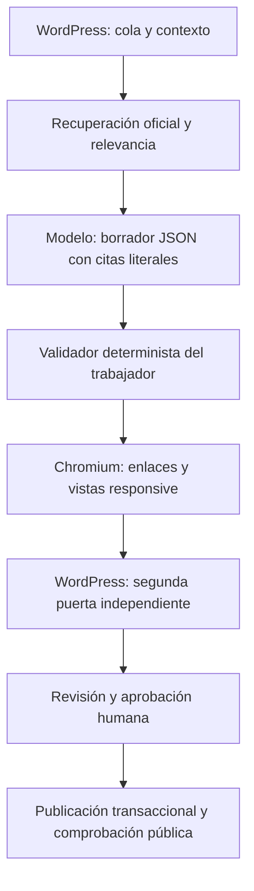

# CE-IA · Auditor seguro de trámites

Sistema gratuito, controlado desde WordPress, para investigar y mantener las páginas de trámites del Consejo de Estudiantes de la Universidad de Oviedo.

CE-IA 0.12.0 funciona como auditor con fallo seguro. El modelo redacta y estructura una propuesta, pero no decide si está verificada: el trabajador y WordPress aplican controles independientes antes de permitir su aprobación.

## Barreras obligatorias

- Solo se modifican páginas bajo `https://www.unioviedo.es/cestudiantes/`.
- Las fuentes de contraste se limitan a dominios de UniOvi, Unioviedo, BOE y Principado de Asturias.
- Cada hecho debe conservar una cita textual comprobable.
- Los hechos críticos requieren dos fuentes oficiales distintas y al menos una fuente primaria.
- La confianza técnica y jurídica se calcula de forma determinista y nunca alcanza 1.
- Los fallos de red, HTTP, extracción e irrelevancia se registran por separado.
- Una fuente obligatoria ilegible bloquea el cambio.
- Una propuesta que conserve menos del 80 % del texto queda bloqueada.
- La desaparición de requisitos, plazos, documentos, recursos, órganos, contactos, importes o enlaces internos queda bloqueada.
- El HTML se comprueba por estructura, ids, encabezados, accesibilidad, CSS y enlaces.
- Chromium renderiza capturas reales a 360, 390, 768 y 1440 píxeles.
- Los conflictos se detectan por tipo y asunto, incluso cuando el modelo no los declara.
- WordPress vuelve a ejecutar una puerta independiente antes de aprobar.
- Tras publicar se comprueban la página pública y el índice; cualquier fallo restaura los cambios.

## Arquitectura

El usuario técnico del trabajador solo puede reclamar trabajos y remitir resultados. No puede editar páginas, aprobar ni publicar.

## Estado operativo

- Plugin WordPress: `0.12.0`.
- Worker: `0.12.0`.
- La programación horaria está eliminada.
- La actualización desactiva la cola automática.
- El workflow manual procesa como máximo un trámite durante la evaluación.
- No debe activarse el modo masivo hasta que un conjunto de pilotos de referencia supere todos los controles.

## Piloto seguro

1. Instala el ZIP 0.12.0 y reemplaza la versión anterior.
2. Mantén desactivada la cola automática.
3. Selecciona un trámite de riesgo bajo o medio con fuentes oficiales accesibles.
4. Ejecuta `CE-IA · Conexión y piloto seguro` en modo `piloto_seguro_un_tramite`.
5. Revisa en WordPress `CE-IA → Calidad` los controles, fuentes, diferencias y capturas.
6. Solo una puerta `PASS` permite aprobar; aprobar y publicar siguen siendo acciones separadas.

## Coste y privacidad

El trabajador se ejecuta en GitHub Actions y utiliza Gemini Flash-Lite. Las claves no se guardan en el repositorio. El modelo no recibe credenciales de WordPress y nunca dispone de permisos de publicación.
